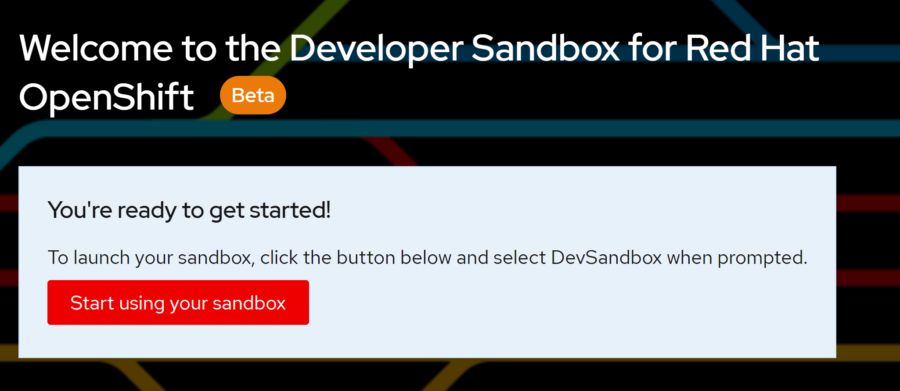
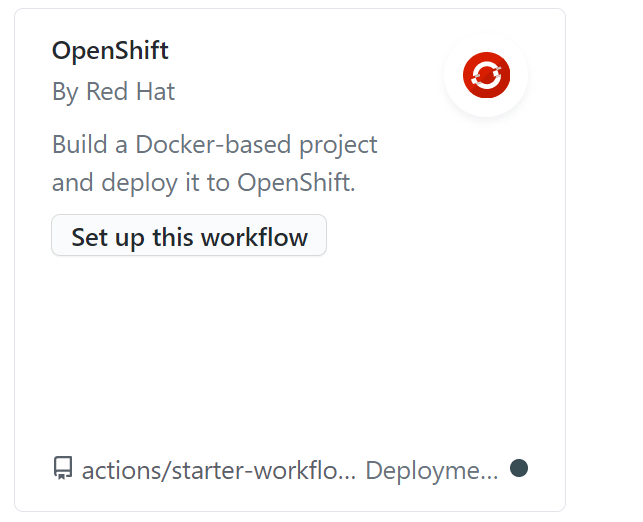
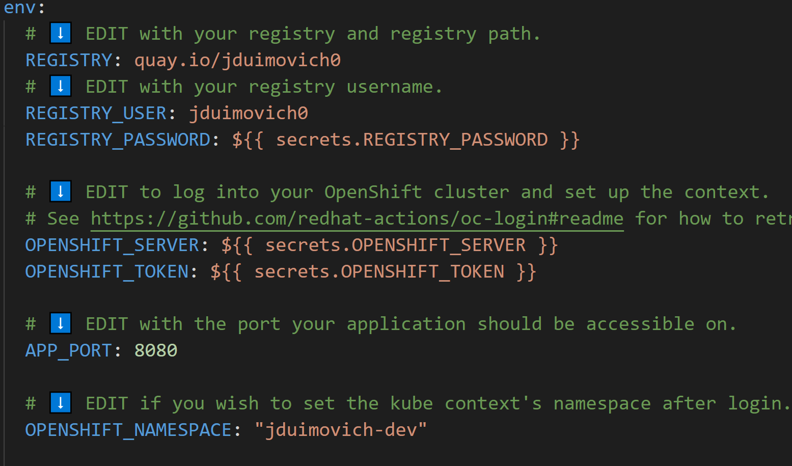

# Simple Container Based App 

## Build and Deploy a containerized app to OpenShift. 

This demo shows a simple container based app can easily be bootstrapped onto an openshift cluster.
This application runs a simple node.js server and serves up HTML pages. 

Try it out by forking this demo or use your own container based application.
 
 
| ----------- | ----------- |
| 1. Get a sandbox account at https://developers.redhat.com/developer-sandbox      |        |
| 2. Add the OpenShift Workflow in the Actions tab of in your GitHub repository.   |          |
| 3. Fill in the details for each of the necessary components. Each edit location is marked with  a  ⬇️ so you can easily find and configure the workflow.       | .    |

| 4. Push your changes and watch it build and deploy to your cluster.  You can find the destination app in the build log or in the destination cluster. 
  |          |
 

